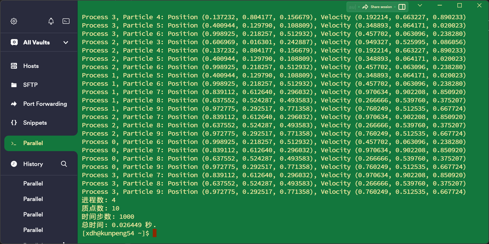

### 软硬件环境：


内核：Linux

网络节点上的主机名：kunpeng66.localdomin

内核发行号：4.19.90

内核版本：#4 SMP Tue Feb 15 22:54:24 CST 2022

硬件架构：aarch64

操作系统：GNU/Linux


### 题目一：用pthread解决欧拉-黎曼函数

#### pthread

编译：

```bash
gcc -o riemann_zeta_pthread riemann_zeta_pthread.c -lpthread -lm
```

运行：

```bash
./riemann_zeta_pthread num_threads num_s num_k
```


上图是x和k不变的情况下，只改变线程数量


问题1：

结果不对

原因：

实验指导文档中公式有误，指数`i+1`应该改为`i+j`


问题2：

运行结果太慢，for循环中的pow计算可以外提，避免重复计算


结果：

1. s、k不变，线程数改变，比较运行时间


2. s、线程数不变，k改变，比较运行时间


#### OpenMP

编译：

```bash
gcc -fopenmp -o riemann_zeta_openmp riemann_zeta_openmp.c -lm
```

运行：

```bash
./riemann_zeta_openmp <MAX_THREADS> <s> <k>
```

结果：

1. s、k不变，线程数改变，比较运行时间


2. s、线程数不变，k改变，比较运行时间


### 题目二：用MPI解决N体问题

编译：

```
mpicc -o nbody_mpi nbody_mpi.c -lm
```

运行：

```
./nbody_mpi
```

结果：



#### 质点数和时间步数不变，改变进程数：

* 进程数为1


* 进程数为2


* 进程数为4


* 进程数为8


#### 进程数和时间步数不变，改变质点数：

* 质点数为10


* 质点数为100


* 质点数为1000


#### 质点数和进程数不变，改变时间步数：

* 时间步数为10


* 时间步数为100


* 时间步数为1000


问题1：

在输出信息中，出现了"nan"，这表示在计算中出现了非数值（Not-a-Number）。这通常是由于物体之间的距离过小而导致的数值不稳定性，导致计算引力的分母变为零，进而导致除以零的情况。为了避免这种情况，可以在计算前添加一些检查和处理。


问题2：

加速比有时候大于1有时候小于1

串行和并行执行两次的初始值不一样，应该设置为一样的


结果：（**每800时间步输出一次，可以调整**）


### 题目三：用OpenMP解决Kmeans问题
使用的数据集为[iris](https://archive.ics.uci.edu/dataset/53/iris)

#### OpenMP

编译：

```bash
gcc -fopenmp -o ./kmeans_iris_openmp ./kmeans_iris_openmp.c -lm
```

`#pragma omp parallel for`是OpenMP中的一个指令，表示接下来的for循环将被多线程执行，另外每次循环之间不能有关系

运行：

```bash
./kmeans_iris_openmp
```


问题1：

/usr/bin/ld: /tmp/cc9Mgky3.o: in function euclidean_distance:
kmeans.c:(.text+0x80): undefined reference to sqrt

解决：

编译时加 `-lm`


问题2：

多线程比单线程还慢，可能是线程管理开销比较大，但是尝试增加NUM_POINTS或MAX_ITERATIONS的值


结果：


